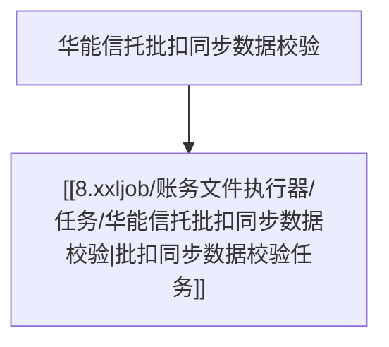

> 本页维护当前契约。本次差异、风险、测试结果与评审结论统一放在设计文档。按适用场景填写，未核实写待确认；不适用写依据。

# 任务说明
> 说明该任务流做什么、何时触发、失败如何处理。
> 使用流程图或者时序图说明。任务流的流程图中可以直接引用对应的任务。

{{：任务流简述，描述任务做什么}}

```mermaid
graph TD
  1[华能信托批扣同步数据校验] --> 2[" [[8.xxljob/账务文件执行器/任务/华能信托批扣同步数据校验|批扣同步数据校验任务]]"]
```
